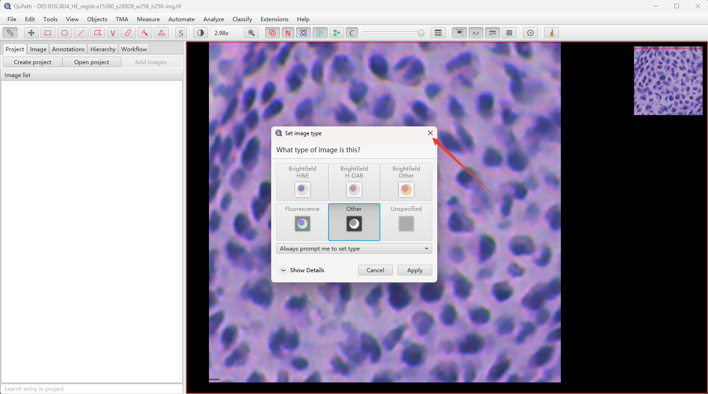
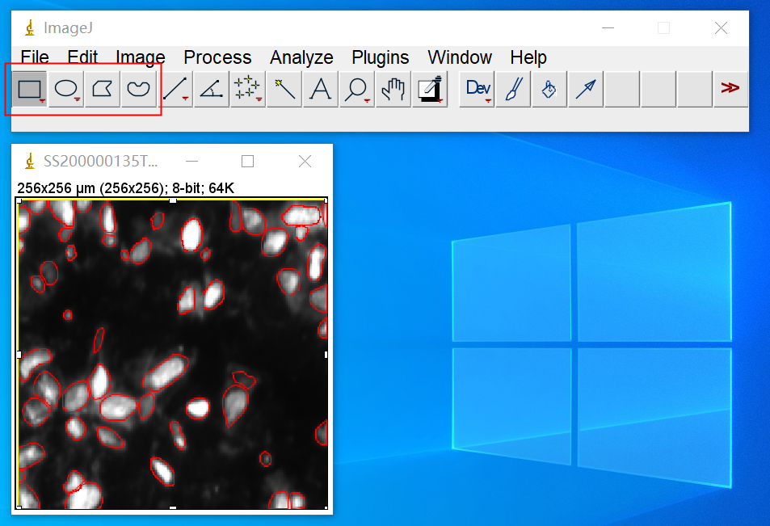
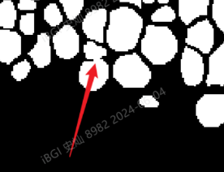
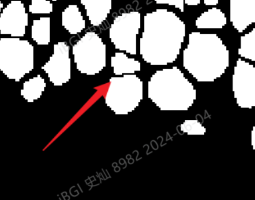
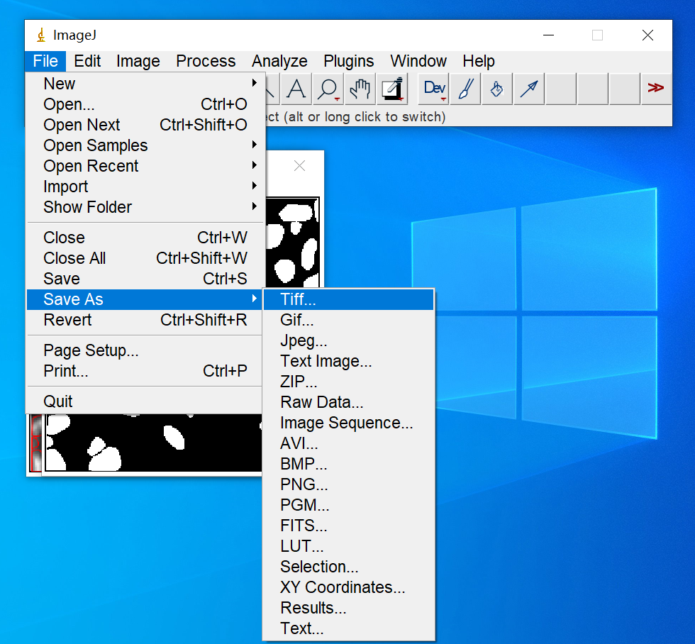
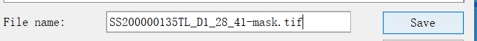

# Tutorial on cell annotation using Qupath

This tutorial details how to use Qupath software to annotate cell images. The annotated images are used as GroundTruth for model fine-tuning training sets.

## Catalogue

- [Install and open Qupath](#install-and-open-qupath)
- [Load the image to be annotated](#load-the-image-to-be-annotated)
- [Annotate cell regions](#annotate-cell-regions)
- [Save annotation results](#save-annotation-results)

## Install and open Qupath

Download the compressed file from the link below, unzip the Qupath compressed file, and double-click QuPath-0.4.3.exe to open it.

https://bgipan.genomics.cn/#/link/cn7TXJgdIt2dGkH36Mg2

Password: cAlM

## Load the image to be annotated

Drag the image to be annotated into the Qupath window. The small window shown in the figure below can be closed directly.

## Annotate cell regions

There are 2 recommended options: 
- [Polygon tool](#annotate-cells-using-the-polygon-tool)
- [Brush tool](#annotate-cells-using-the-brush-tool) 

### Annotate cells using the polygon tool

Select the Polygon tool

You can zoom in and out the image and adjust the annotation accuracy by sliding the scroll wheel. The use of the polygon tool is shown in the video below.

[Annotate cells using the polygon tool](./videos/Annotate%20cells%20using%20the%20polygon%20tool.mp4)

### Annotate cells using the brush tool

Select the Brush Tool

Hold down the left button to expand the mask range.

Hold down alt and press the left button to reduce the range from outside the mask.

[Annotate cells using the brush tool](./videos/Annotate%20cells%20using%20the%20brush%20tool.mp4)

## Save annotation results

Click a blank area to make sure no cells are selected.

Extensions > ImageJ > Send region to ImageJ

Or directly click the ImageJ icon > Send region to ImageJ

First, cancel the selection (ImageJ will have a selection by default when it is opened): select any one of the red boxes as shown below, and click the image to cancel the selection.

Edit > Selection > Create mask

If adjacent cells are adherent, you can use watershed (Process > Binary > Watershed) for segmentation.

Watershed processing effect example.

After confirmation, save: File > Save As > Tiff...

The mask naming is consistent with the original image naming, with only the difference between "img" and "mask".

After the annotation is completed, save the Gejson locally for easy modification later! File > Export objects as Geojson.

